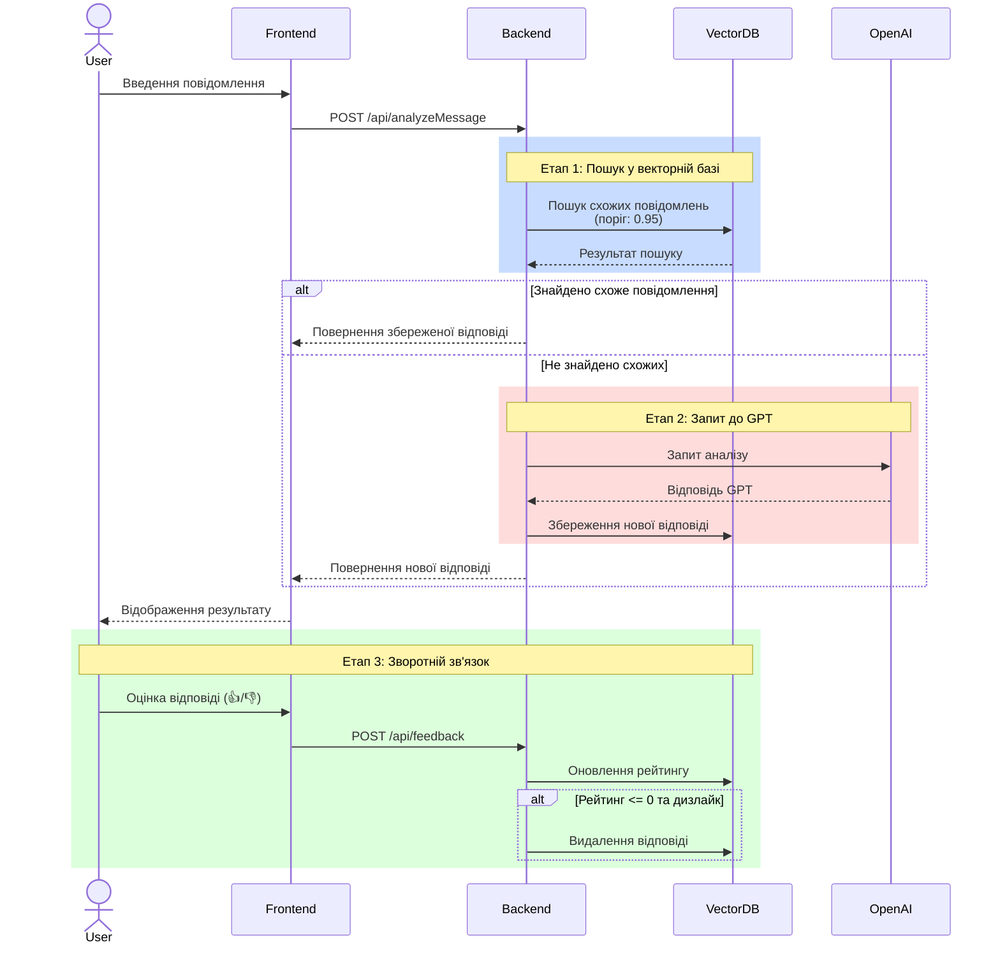

# MyEmpathy: Система покращення емоційної складової повідомлень

## 📝 Опис проекту

MyEmpathy - це інноваційна система, розроблена для курсової роботи з Generative AI, яка використовує передові технології штучного інтелекту для аналізу та покращення емоційної складової текстових повідомлень. Проект демонструє практичне застосування генеративного ШІ для вирішення реальних комунікаційних завдань.

## 🏗 Архітектура системи

### Діаграма обробки запиту



### Детальний опис процесу

1. **Обробка вхідного повідомлення**
   - Користувач вводить текст для аналізу
   - Фронтенд відправляє запит на бекенд
   - Система визначає мову повідомлення

2. **Пошук у векторній базі даних**
   - Створення векторного ембеддінгу повідомлення
   - Пошук схожих повідомлень з порогом 0.95
   - Перевірка типу повідомлення (аналіз/перефразування)

3. **Взаємодія з GPT**
   - Якщо схоже повідомлення не знайдено:
     - Формування промпту для GPT-3.5
     - Отримання структурованої відповіді
     - Збереження результату у векторній базі

4. **Система рейтингу та зворотного зв'язку**
   - Кожне повідомлення починає з рейтингу 0
   - Лайк: +1 до рейтингу
   - Дизлайк: -1 до рейтингу
   - При рейтингу 0 або менше + дизлайк:
     - Повідомлення видаляється з бази

5. **A/B тестування**
   - Конфігурація через змінні середовища:
     ```env
     AB_TEST_OPENAI_WEIGHT=0
     AB_TEST_VECTOR_DB_WEIGHT=100
     ```
   - Можливість гнучкого налаштування пропорцій
   - Збір метрик для порівняння підходів

## 🤖 Використання Generative AI

### Основні компоненти ШІ

1. **Аналіз тексту за допомогою GPT-3.5**
   - Використання спеціалізованих промптів для аналізу емоційної складової
   - Структурований аналіз самоусвідомлення, саморегуляції, емпатії та соціальних навичок
   - Генерація покращених версій повідомлень з більшою емпатією

2. **Векторна база даних (Weaviate)**
   - Семантичний пошук схожих повідомлень
   - Використання Sentence Transformers для створення векторних ембеддінгів
   - Оптимізація через систему рейтингу та зворотного зв'язку

3. **Система A/B тестування**
   - Порівняння ефективності різних моделей
   - Гнучке налаштування порогу впевненості для векторної бази
   - Збір та аналіз метрик якості відповідей

### Особливості реалізації

1. **Промпт-інжиніринг**
   - Структуровані JSON-відповіді для уніфікації формату
   - Багатомовна підтримка (українська, російська, англійська)
   - Контекстно-залежний аналіз повідомлень

2. **Оптимізація використання API**
   - Кешування та повторне використання успішних відповідей
   - Система рейтингу для видалення неякісних відповідей
   - Балансування навантаження між моделями

## 🛠 Технічний стек

### Frontend
- React + TypeScript
- Ant Design для UI компонентів
- Styled Components для стилізації
- Vite для збірки проекту

### Backend
- Python + FastAPI
- OpenAI API для GPT-3.5
- Weaviate для векторної бази даних
- Whisper API для розпізнавання мовлення

### Інфраструктура
- Docker + Docker Compose
- Мікросервісна архітектура
- REST API
- WebSocket для голосового вводу

## 🚀 Основні функції

1. **Аналіз повідомлень**
   - Детальний аналіз емоційної складової
   - Оцінка рівня емпатії
   - Рекомендації щодо покращення

2. **Покращення тексту**
   - Генерація більш емпатичної версії
   - Створення короткої та розгорнутої версій
   - Збереження основного змісту при покращенні тону

3. **Система зворотного зв'язку**
   - Оцінка якості відповідей
   - Автоматичне видалення неякісних прикладів
   - Накопичення бази якісних відповідей

4. **Додаткові можливості**
   - Голосовий ввід
   - Експорт результатів у PDF
   - Копіювання покращених версій

## 📊 Дослідницька складова

### Експерименти та результати

1. **Оптимізація порогу впевненості**
   - Початковий поріг: 0.3
   - Оптимальний поріг: 0.95
   - Вплив на якість відповідей

2. **A/B тестування моделей**
   - Порівняння прямого використання GPT і векторної бази
   - Аналіз швидкодії та якості відповідей
   - Економічна ефективність різних підходів

### Висновки

- Ефективність використання векторної бази для частих запитів
- Важливість якісного промпт-інжинірингу
- Баланс між швидкістю та якістю відповідей

## 🔧 Встановлення та запуск

### Вимоги
- Docker і Docker Compose
- OpenAI API ключ
- Мінімум 8 ГБ RAM

### Кроки встановлення

1. Клонування репозиторію:
```bash
git clone [repository-url]
cd my-empathy-app
```

2. Налаштування змінних середовища:
```bash
cp .env.example .env
# Відредагуйте .env файл, додавши необхідні ключі API
```

3. Запуск проекту:
```bash
docker-compose up -d
```

## 🔄 Плани розвитку

1. **Технічні вдосконалення**
   - Інтеграція нових моделей ШІ
   - Покращення системи навчання на відгуках
   - Розширення мовної підтримки

2. **Функціональні доповнення**
   - Аналіз емоційного стану по голосу
   - Розширена статистика використання
   - Групові рекомендації

## 👥 Автори та подяки

Проект розроблено в рамках курсової роботи з Generative AI.

Особлива подяка:
- OpenAI за доступ до API
- Команді Weaviate за відмінну векторну базу даних
- Спільноті розробників за підтримку та поради
