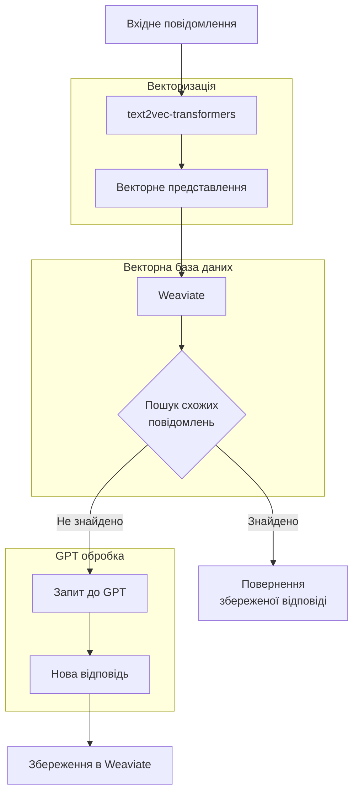
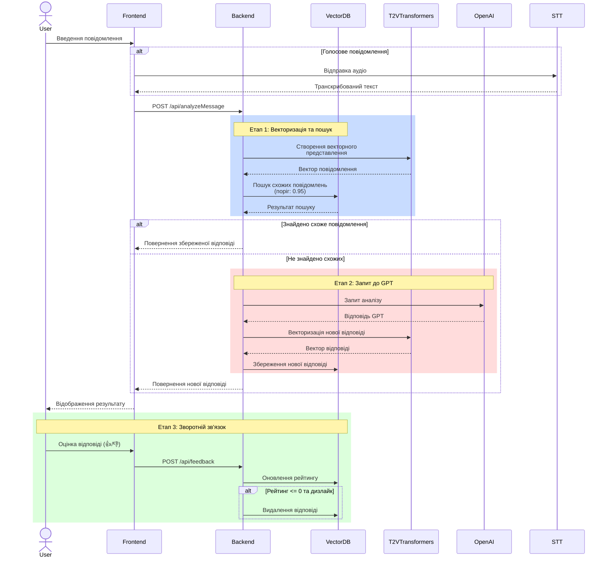

# MyEmpathy: Система покращення емоційної складової повідомлень

## 📝 Опис проекту

MyEmpathy - це інноваційна система, розроблена для курсової роботи з Generative AI, яка використовує передові технології штучного інтелекту для аналізу та покращення емоційної складової текстових повідомлень. Проект демонструє практичне застосування генеративного ШІ для вирішення реальних комунікаційних завдань.

## 🏗 Архітектура системи

### Діаграма векторизації та пошуку



### Діаграма обробки запиту



### Детальний опис процесу

1. **Обробка запитів (FastAPI Backend)**
   - Сервіс: `backend` (backend/python/app)
     - Валідація вхідних даних
     - Нормалізація тексту
     - Визначення мови повідомлення
     - Маршрутизація запитів
     - Логування
   - Основні ендпоінти:
     - POST /api/analyzeMessage
     - POST /api/rewriteMessage
     - POST /api/feedback
   - Особливості:
     - Асинхронна обробка запитів
     - Обробка помилок
     - Валідація через Pydantic
     - Автоматична документація (Swagger/OpenAPI)

2. **Векторизація та пошук**
   - Сервіс: `t2v-transformers`
     - Багатомовна підтримка
     - GPU-прискорення
     - Оптимізація пам'яті
   - База даних: `weaviate`
     - Векторне сховище
     - Семантичний пошук
     - Управління схемою

3. **Взаємодія з GPT**
   - Сервіс: `gpt-service` (backend/services/gpt)
     - Управління промптами
     - Обробка відповідей
     - Retry-стратегії
   - Кеш: `redis-cache` (deployments/redis)
     - Кешування відповідей
     - Зберігання метрик
     - Управління лімітами

4. **Система рейтингу та зворотного зв'язку**
   - Функціонал: `feedback-service`
     - Обробка оцінок користувачів
     - Агрегація метрик
     - Тригери видалення неякісних відповідей
   - Особливості:
     - Автоматичне видалення при низькому рейтингу
     - Збереження успішних прикладів
     - Аналіз якості відповідей

5. **A/B тестування**
   - Конфігурація через змінні середовища:
     - Ваги для різних моделей
     - Пороги впевненості
     - Налаштування експериментів
   - Метрики:
     - Час відповіді
     - Якість відповідей
     - Задоволеність користувачів

## 🤖 Використання Generative AI

### Основні компоненти ШІ

1. **Аналіз тексту за допомогою GPT-3.5**
   - Використання спеціалізованих промптів для аналізу емоційної складової
   - Структурований аналіз самоусвідомлення, саморегуляції, емпатії та соціальних навичок
   - Генерація покращених версій повідомлень з більшою емпатією

2. **Векторна база даних та text2vec-transformers**
   - Семантичний пошук схожих повідомлень через Weaviate
   - Векторизація тексту через text2vec-transformers
   - Оптимізація через систему рейтингу та зворотного зв'язку

3. **Система A/B тестування**
   - Порівняння ефективності прямих запитів до GPT та векторного пошуку
   - Гнучке налаштування порогу впевненості для векторної бази
   - Збір та аналіз метрик якості відповідей

### Особливості реалізації

1. **Обробка вхідного повідомлення**
   - Валідація та нормалізація тексту
   - Визначення мови повідомлення
   - Автоматичний вибір мови відповіді

2. **Векторний пошук**
   - Створення векторних представлень через text2vec-transformers
   - Ефективний пошук у Weaviate
   - Кешування результатів для оптимізації

3. **Взаємодія з GPT**
   - Спеціалізовані промпти для різних мов
   - Структурований формат відповідей
   - Обробка помилок та повторні спроби

4. **Система зворотного зв'язку**
   - Оцінка якості відповідей користувачами
   - Автоматичне видалення неякісних прикладів
   - Накопичення бази якісних відповідей

## 🛠 Технічний стек

### Frontend
- React + TypeScript
- Ant Design для UI компонентів
- Styled Components для стилізації
- Vite для збірки проекту

### Backend
- Python + FastAPI
- OpenAI API для GPT-3.5
- text2vec-transformers для векторизації
- Weaviate для векторної бази даних
- Whisper API для розпізнавання мовлення

### Інфраструктура
- Docker + Docker Compose
- Мікросервісна архітектура
- REST API
- WebSocket для голосового вводу

## 🚀 Основні функції

1. **Аналіз повідомлень**
   - Детальний аналіз емоційної складової
   - Оцінка рівня емпатії
   - Рекомендації щодо покращення

2. **Голосовий ввід**
   - Транскрибація голосових повідомлень через Whisper API
   - Підтримка різних мов введення
   - Обробка аудіопотоку в реальному часі
   - Кешування частих фраз для швидкої відповіді
   - Оптимізація якості аудіо перед обробкою

3. **Покращення тексту**
   - Генерація більш емпатичної версії
   - Створення короткої та розгорнутої версій
   - Збереження основного змісту при покращенні тону

4. **Система зворотного зв'язку**
   - Оцінка якості відповідей
   - Автоматичне видалення неякісних прикладів
   - Накопичення бази якісних відповідей

5. **Додаткові можливості**
   - Експорт результатів у PDF
   - Копіювання покращених версій
   - Статистика використання

## 📊 Дослідницька складова

### Експерименти та результати

1. **Оптимізація порогу впевненості**
   - Початковий поріг: 0.3
   - Оптимальний поріг: 0.95
   - Вплив на якість відповідей

2. **A/B тестування підходів**
   - Порівняння прямого використання GPT і векторного пошуку
   - Аналіз швидкодії та якості відповідей
   - Економічна ефективність різних підходів

### Висновки

- Ефективність використання векторної бази для частих запитів
- Важливість якісного промпт-інжинірингу
- Баланс між швидкістю та якістю відповідей

## 🔧 Встановлення та запуск

### Вимоги
- Docker і Docker Compose
- OpenAI API ключ
- Мінімум 8 ГБ RAM
- NVIDIA GPU з CUDA підтримкою (рекомендовано для t2v-transformers)

### Кроки встановлення

1. **Клонування репозиторію:**
```bash
git clone [URL репозиторію]
cd my-empathy-app
```

2. **Налаштування змінних середовища:**
```bash
cp .env.example .env
```

Відредагуйте `.env` файл та налаштуйте наступні важливі змінні:

- `OPENAI_API_KEY`: Ваш ключ API від OpenAI
- `ENVIRONMENT`: Виберіть `development` або `production`
- `VECTOR_DB_CONFIDENCE_THRESHOLD`: За замовчуванням 0.95
- `T2V_TRANSFORMERS_HOST`: URL для сервісу векторизації
- `T2V_TRANSFORMERS_PORT`: Порт для сервісу векторизації
- `T2V_BATCH_SIZE`: Розмір пакету для векторизації
- `T2V_MODEL_NAME`: Назва моделі для векторизації
- `T2V_MAX_LENGTH`: Максимальна довжина тексту
- `T2V_COMPUTE_TYPE`: Тип обчислень (float16/float32)
- `WEAVIATE_HOST` та `WEAVIATE_PORT`: Налаштування векторної бази даних
- `AB_TEST_OPENAI_WEIGHT`: Вага для прямих запитів до OpenAI
- `AB_TEST_VECTOR_DB_WEIGHT`: Вага для векторного пошуку

3. **Запуск проекту:**
```bash
docker-compose up -d
```

4. **Перевірка статусу:**
```bash
docker-compose ps
```

### Структура проекту

```
my-empathy-app/
├── backend/
│   └── python/
│       ├── app/
│       │   ├── api/
│       │   ├── config/
│       │   ├── models/
│       │   ├── prompts/
│       │   └── services/
│       └── main.py
├── frontend/
│   ├── src/
│   │   ├── components/
│   │   ├── pages/
│   │   └── services/
│   └── package.json
├── docker-compose.yml
└── README.md
```

## 🔄 Плани розвитку

1. **Технічні вдосконалення**
   - Оптимізація векторного пошуку
   - Покращення системи навчання на відгуках
   - Розширення мовної підтримки

2. **Функціональні доповнення**
   - Розширена статистика використання
   - Групові рекомендації
   - Покращення UI/UX

## 👥 Автори та подяки

Проект розроблено в рамках курсової роботи з Generative AI.

Особлива подяка:
- Академії [RobotDreams](https://robotdreams.cc) за чудовий навчальний курс
- OpenAI за доступ до API
- Команді Weaviate за відмінну векторну базу даних
- Команді SemitechAI за text2vec-transformers
- Спільноті розробників за підтримку та поради
