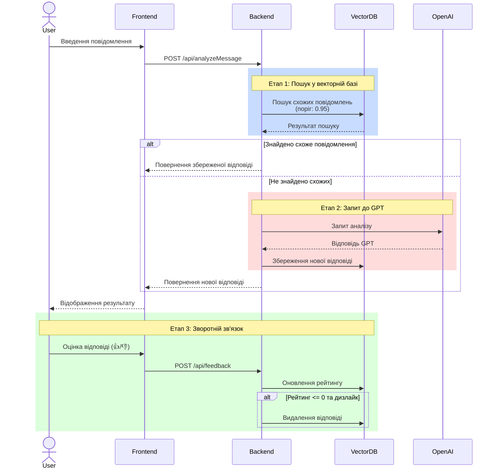

# MyEmpathy: Система покращення емоційної складової повідомлень

## 📝 Опис проекту

MyEmpathy - це інноваційна система, розроблена для курсової роботи з Generative AI, яка використовує передові технології штучного інтелекту для аналізу та покращення емоційної складової текстових повідомлень. Проект демонструє практичне застосування генеративного ШІ для вирішення реальних комунікаційних завдань.

## 🏗 Архітектура системи

### Діаграма обробки запиту



### Детальний опис процесу

1. **Обробка вхідного повідомлення**
   - Сервіс: `message-processor` (frontend/src/services/MessageProcessor)
     - Валідація вхідних даних
     - Нормалізація тексту
     - Визначення мови через Azure Cognitive Services
   - API Gateway: `api-gateway` (backend/gateway)
     - Маршрутизація запитів
     - Балансування навантаження
     - Логування запитів

2. **Пошук у векторній базі даних**
   - Сервіс: `vector-search` (backend/services/vector-search)
     - Генерація ембеддінгів через SentenceTransformers
     - Взаємодія з Weaviate
     - Кешування популярних запитів
   - База даних: `weaviate-db` (deployments/weaviate)
     - Зберігання векторів
     - Конфігурація індексів
     - Налаштування реплікації

3. **Взаємодія з GPT**
   - Сервіс: `gpt-service` (backend/services/gpt)
     - Управління промптами
     - Обробка відповідей
     - Retry-стратегії
   - Кеш: `redis-cache` (deployments/redis)
     - Кешування відповідей
     - Зберігання метрик
     - Управління лімітами

4. **Система рейтингу та зворотного зв'язку**
   - Сервіс: `feedback-service` (backend/services/feedback)
     - Обробка оцінок
     - Агрегація метрик
     - Тригери видалення
   - База даних: `postgres-main` (deployments/postgres)
     - Зберігання рейтингів
     - Аналітичні звіти
     - Архівація даних

5. **A/B тестування**
   - Сервіс: `ab-test-manager` (backend/services/ab-test)
     - Управління конфігурацією
     - Збір метрик
     - Аналіз результатів
   - Моніторинг: `prometheus` (deployments/monitoring)
     - Збір метрик тестування
     - Візуалізація через Grafana
     - Алерти при відхиленнях

## 🤖 Використання Generative AI

### Основні компоненти ШІ

1. **Аналіз тексту за допомогою GPT-3.5**
   - Використання спеціалізованих промптів для аналізу емоційної складової
   - Структурований аналіз самоусвідомлення, саморегуляції, емпатії та соціальних навичок
   - Генерація покращених версій повідомлень з більшою емпатією

2. **Векторна база даних (Weaviate)**
   - Семантичний пошук схожих повідомлень
   - Використання Sentence Transformers для створення векторних ембеддінгів
   - Оптимізація через систему рейтингу та зворотного зв'язку

3. **Система A/B тестування**
   - Порівняння ефективності різних моделей
   - Гнучке налаштування порогу впевненості для векторної бази
   - Збір та аналіз метрик якості відповідей

### Особливості реалізації

1. **Обробка вхідного повідомлення**
   - Сервіс: `message-processor` (frontend/src/services/MessageProcessor)
     - Валідація вхідних даних
     - Нормалізація тексту
     - Визначення мови через Azure Cognitive Services
   - API Gateway: `api-gateway` (backend/gateway)
     - Маршрутизація запитів
     - Балансування навантаження
     - Логування запитів

2. **Пошук у векторній базі даних**
   - Сервіс: `vector-search` (backend/services/vector-search)
     - Генерація ембеддінгів через SentenceTransformers
     - Взаємодія з Weaviate
     - Кешування популярних запитів
   - База даних: `weaviate-db` (deployments/weaviate)
     - Зберігання векторів
     - Конфігурація індексів
     - Налаштування реплікації

3. **Взаємодія з GPT**
   - Сервіс: `gpt-service` (backend/services/gpt)
     - Управління промптами
     - Обробка відповідей
     - Retry-стратегії
   - Кеш: `redis-cache` (deployments/redis)
     - Кешування відповідей
     - Зберігання метрик
     - Управління лімітами

4. **Система рейтингу та зворотного зв'язку**
   - Сервіс: `feedback-service` (backend/services/feedback)
     - Обробка оцінок
     - Агрегація метрик
     - Тригери видалення
   - База даних: `postgres-main` (deployments/postgres)
     - Зберігання рейтингів
     - Аналітичні звіти
     - Архівація даних

5. **A/B тестування**
   - Сервіс: `ab-test-manager` (backend/services/ab-test)
     - Управління конфігурацією
     - Збір метрик
     - Аналіз результатів
   - Моніторинг: `prometheus` (deployments/monitoring)
     - Збір метрик тестування
     - Візуалізація через Grafana
     - Алерти при відхиленнях

6. **Оптимізація використання API**
   - Кешування та повторне використання успішних відповідей
   - Система рейтингу для видалення неякісних відповідей
   - Балансування навантаження між моделями

## 🛠 Технічний стек

### Frontend
- React + TypeScript
- Ant Design для UI компонентів
- Styled Components для стилізації
- Vite для збірки проекту

### Backend
- Python + FastAPI
- OpenAI API для GPT-3.5
- Weaviate для векторної бази даних
- Whisper API для розпізнавання мовлення

### Інфраструктура
- Docker + Docker Compose
- Мікросервісна архітектура
- REST API
- WebSocket для голосового вводу

## 🚀 Основні функції

1. **Аналіз повідомлень**
   - Детальний аналіз емоційної складової
   - Оцінка рівня емпатії
   - Рекомендації щодо покращення

2. **Покращення тексту**
   - Генерація більш емпатичної версії
   - Створення короткої та розгорнутої версій
   - Збереження основного змісту при покращенні тону

3. **Система зворотного зв'язку**
   - Оцінка якості відповідей
   - Автоматичне видалення неякісних прикладів
   - Накопичення бази якісних відповідей

4. **Додаткові можливості**
   - Голосовий ввід
   - Експорт результатів у PDF
   - Копіювання покращених версій

## 📊 Дослідницька складова

### Експерименти та результати

1. **Оптимізація порогу впевненості**
   - Початковий поріг: 0.3
   - Оптимальний поріг: 0.95
   - Вплив на якість відповідей

2. **A/B тестування моделей**
   - Порівняння прямого використання GPT і векторної бази
   - Аналіз швидкодії та якості відповідей
   - Економічна ефективність різних підходів

### Висновки

- Ефективність використання векторної бази для частих запитів
- Важливість якісного промпт-інжинірингу
- Баланс між швидкістю та якістю відповідей

## 🔧 Встановлення та запуск

### Вимоги
- Docker і Docker Compose
- OpenAI API ключ
- Мінімум 8 ГБ RAM

### Кроки встановлення

1. **Клонування репозиторію:**
```bash
git clone [https://github.com/YurovskyyAndriy/my-empathy-app]
cd my-empathy-app
```

2. **Налаштування змінних середовища:**
```bash
cp .env.example .env
```

Відредагуйте `.env` файл та налаштуйте наступні важливі змінні:

- `OPENAI_API_KEY`: Ваш ключ API від OpenAI
- `SECRET_KEY`: Згенеруйте за допомогою `openssl rand -hex 32`
- `ENVIRONMENT`: Виберіть `development` або `production`
- `VECTOR_DB_CONFIDENCE_THRESHOLD`: За замовчуванням 0.95
- `WHISPER_HOST`: URL для сервісу розпізнавання мовлення
- `DATABASE_URL`: URL для підключення до бази даних

Додаткові налаштування:
- `FRONTEND_PORT`: Порт для фронтенду (за замовчуванням 3000)
- `WEAVIATE_HOST` та `WEAVIATE_PORT`: Налаштування векторної бази даних
- `MCP_ENABLED`: Увімкнення Message Control Processor
- `DEBUG`: Режим налагодження

3. **Запуск проекту:**
```bash
docker-compose up -d
```

4. **Перевірка статусу:**
```bash
docker-compose ps
```

### Структура .env файлу

Файл `.env.example` містить всі необхідні змінні середовища з прикладами значень:

```env
# General Settings
NODE_ENV=development
FRONTEND_PORT=3000

# Weaviate settings
WEAVIATE_HOST=vector-store
WEAVIATE_PORT=8081
VECTOR_STORE_PORT=8082
...

# Повний список змінних та їх опис дивіться в .env.example
```

### Налаштування для розробки

Для локальної розробки:
1. Встановіть `NODE_ENV=development`
2. Увімкніть `DEBUG=True`
3. Використовуйте локальні URL'и для сервісів

### Налаштування для продакшену

Для production середовища:
1. Встановіть `NODE_ENV=production`
2. Вимкніть `DEBUG=False`
3. Налаштуйте безпечні URL'и та порти
4. Змініть `SECRET_KEY`
5. Налаштуйте SSL/TLS

## 🔄 Плани розвитку

1. **Технічні вдосконалення**
   - Інтеграція нових моделей ШІ
   - Покращення системи навчання на відгуках
   - Розширення мовної підтримки
   - Навчання локальної LLM на базі популярних відповідей:
     - Збір та підготовка даних з високим рейтингом
     - Файнтюнінг open-source моделі на власному датасеті
     - Поступова інтеграція через A/B тестування
     - Поетапна заміна запитів до OpenAI на локальну модель
     - Повний перехід на власну LLM при досягненні необхідної якості

2. **Функціональні доповнення**
   - Аналіз емоційного стану по голосу
   - Розширена статистика використання
   - Групові рекомендації

## 👥 Автори та подяки

Проект розроблено в рамках курсової роботи з Generative AI.

Особлива подяка:
- Академії [RobotDreams](https://robotdreams.cc) за чудовий навчальний курс
- Лекторам курсу:
  - Юрій Хома
  - Данило Нартов
  - Олександр Крижанівський
- OpenAI за доступ до API
- Команді Weaviate за відмінну векторну базу даних
- Спільноті розробників за підтримку та поради
